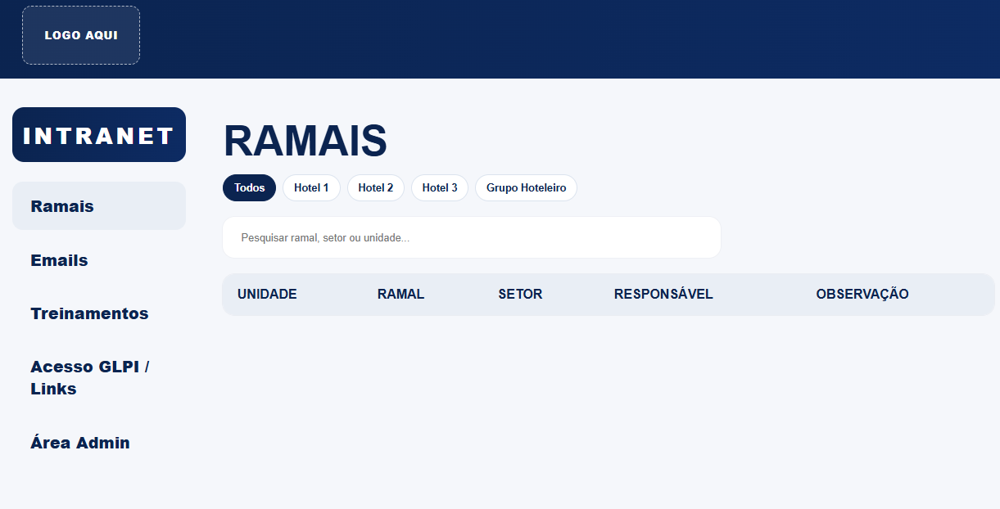
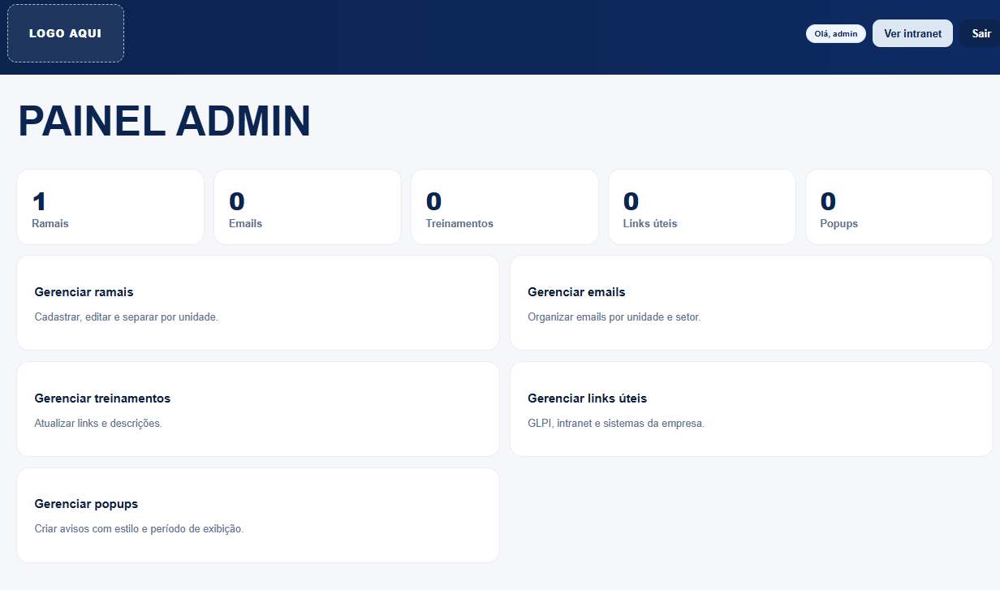
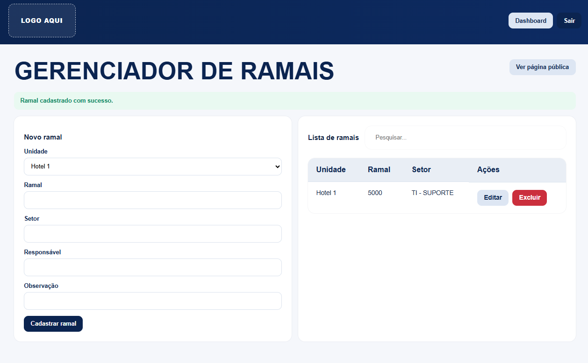
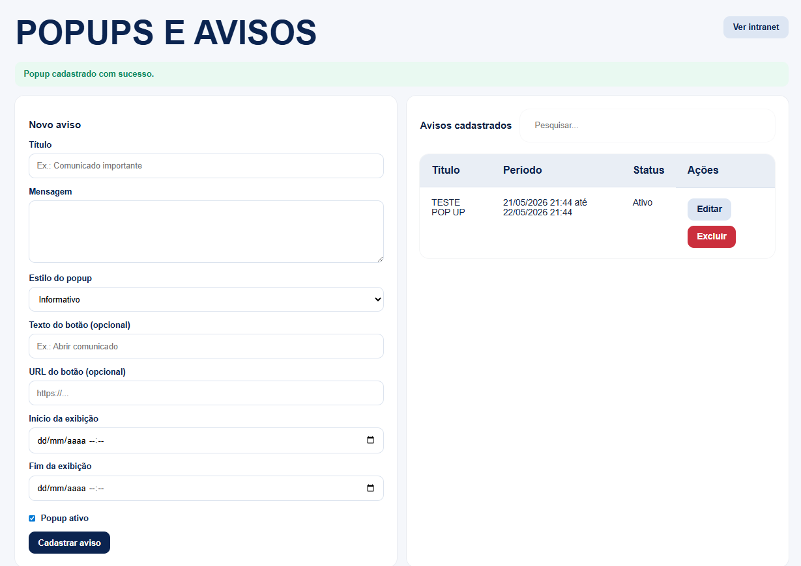
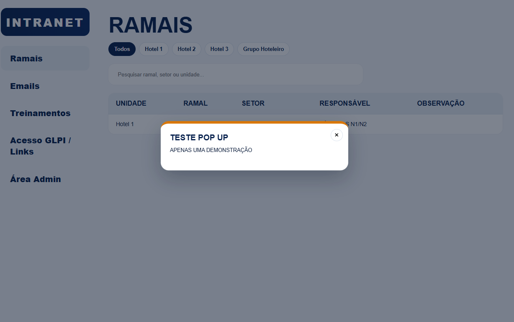

# Intranet Corporativa

Este projeto é uma intranet web desenvolvida com o objetivo de centralizar informações internas de uma organização, facilitando o acesso rápido a dados importantes, como ramais, e-mails, avisos e demais informações úteis para os colaboradores.

A ideia principal do sistema é substituir métodos manuais ou pouco práticos de consulta, oferecendo uma interface mais organizada, responsiva e fácil de manter.

## Objetivo do Projeto

O objetivo deste projeto é demonstrar uma solução simples e funcional de intranet corporativa, permitindo que informações internas sejam cadastradas, organizadas e consultadas de forma prática.

O sistema conta com uma área administrativa para gerenciamento dos dados, possibilitando que alterações sejam feitas de maneira rápida, sem a necessidade de editar arquivos manualmente.


## Funcionalidades

- Consulta de ramais por unidade
- Consulta de e-mails por unidade
- Área administrativa protegida por login
- Cadastro, edição e remoção de ramais
- Cadastro, edição e remoção de e-mails
- Cadastro de treinamentos
- Cadastro de links úteis
- Sistema de popups/avisos internos

## Observação sobre dados

Este pacote foi limpo para uso público no GitHub:

- Dados reais removidos do banco
- Logos e marcas removidas
- Nomes de hotéis substituídos por Hotel 1, Hotel 2 e Hotel 3
- Imagens substituídas pelo texto `LOGO AQUI`
- Arquivos de configuração privada removidos

## Instalação básica

1. Crie o banco:

```sql
CREATE DATABASE intranet_generica CHARACTER SET utf8mb4 COLLATE utf8mb4_unicode_ci;
```

2. Importe o arquivo:

```bash
mysql -u usuario_do_banco -p intranet_generica < database.sql
```

3. Ajuste o arquivo:

```bash
config/config.php
```

4. Aponte o servidor web para a pasta do projeto.

## Stack

- PHP
- MySQL
- Nginx ou Apache
- HTML/CSS/JS

## Primeiro administrador

O banco está sem dados reais. Para criar o primeiro administrador, gere um hash com `password_hash()` no PHP e insira manualmente na tabela `admins`.

Exemplo:

```sql
INSERT INTO admins (name, username, password_hash)
VALUES ('Administrador', 'admin', 'HASH_GERADO_AQUI');
```
## Estrutura do Projeto

```bash
/
├── admin/          # Área administrativa do sistema
├── assets/         # Arquivos de imagem, ícones e recursos visuais
├── config/         # Arquivos de configuração do projeto
├── screenshots/    # Prints de demonstração do projeto
├── partials/       # Componentes reutilizáveis da interface
├── uploads/        # Diretório para arquivos enviados
├── index.php       # Página principal
├── style.css       # Estilos principais
├── script.js       # Scripts JavaScript
└── database.sql    # Estrutura inicial do banco de dados
```
## 📸 Prévia do Projeto

### Tela inicial


### Painel administrativo


### Painel gerenciamento ramais


### Aba gerenciamento PopUps


### Exemplo PopUp

